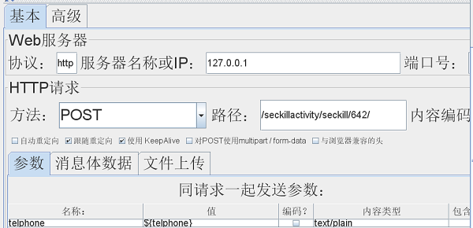
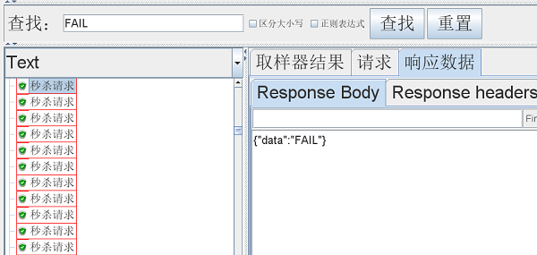

#一、简易秒杀介绍

&emsp;&emsp;基于Spring Boot+MyBatis+Redis+MySQL实现简易秒杀功能。

- 使用EasyCode插件快速生成通用代码
- 使用Lua脚本解决库存遗留问题
- 使用ZSet类型解决重复秒杀
- 使用ProtostuffIOUtil序列化对象
- 使用Jmeter工具测试秒杀

#二、前期准备

##2.1 MySQL数据库准备:

- 对应的SQL见 /src/main/resources/sql/CreateDataBase.sql
- 创建数据库mybatis
- 建表 - product(商品)/seckillactivity(秒杀活动)/seckill_success(秒杀成功记录)
- MySQL配置信息见 /src/main/resources/application.properties

##2.2 Redis数据库准备:

- Redis配置信息见 /src/main/resources/application.properties

##2.3 PostMan测试工具准备:

- [下载地址](https://www.postman.com/)


##2.4 Jmeter测试工具准备:

- [下载地址](http://jmeter.apache.org/download_jmeter.cgi)

#三、测试步骤

##3.1 创建秒杀活动 

&emsp;&emsp;使用PostMan发出请求(id-商品ID & num-秒杀数量):

> http://127.0.0.1:8080/seckillactivity/seckill/start/?id=1&num=10

```
//返回信息-返回id为秒杀活动ID,用于3.2[访问秒杀界面]
{
    "data": {
        "activityname": "薅羊毛-ea18c",
        "id": 642,
        "product": 1,
        "seckillnum": 10
    }
}
```
##3.2 访问秒杀界面 

&emsp;&emsp;使用3.1返回的活动ID,使用PostMan发出请求(将活动信息存入缓存):

> http://127.0.0.1:8080/seckillactivity/selectOne/642

```
//返回秒杀活动信息
{
    "data": {
        "activityname": "薅羊毛-ea18c",
        "id": 642,
        "product": 1,
        "seckillnum": 10
    },
    "status": "默认"
}
```

##3.3 开始秒杀

&emsp;&emsp;使用Jmeter测试工具进行测试,可以直接导入秒杀测试.jmx,将请求信息存入data.csv文件中,秒杀请求配置如下:



##3.4 查看结果





